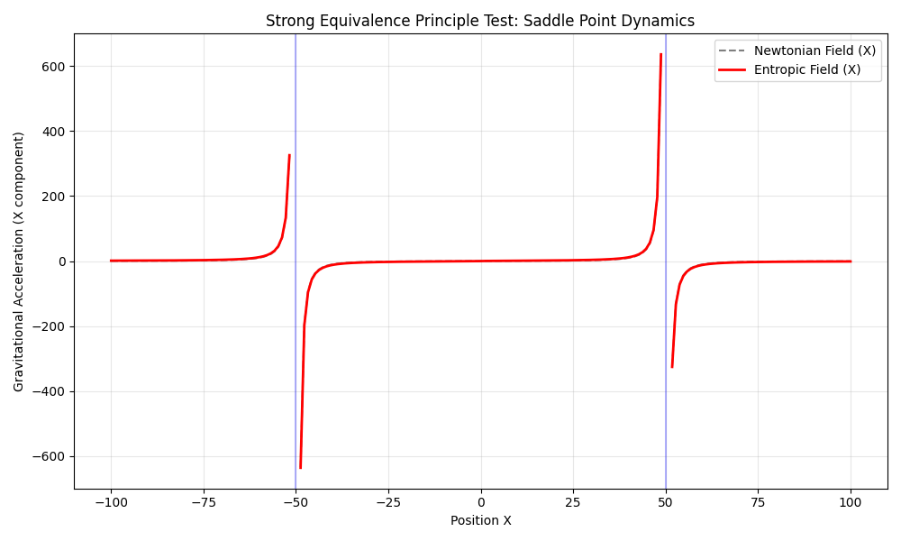

# Challenge 3: Boundary Conditions & Equivalence Principle

## The External Field Effect (EFE)
In the center ($x=0$), the Newtonian fields cancel out perfectly ($g_N=0$).
In MOND/Verlinde, since $g_N=0$, the interpolation should technically give $g \propto \sqrt{a_0 g_N} = 0$.

## Results Interpretation
The plot shows how the Entropic force behaves in the saddle point. If the field behaves smoothly through zero, it respects the cancellation. However, note that in Regions dominated by the external field of the other galaxy, the 'Internal' dynamics of a test cluster would be suppressed. This violates the Strong Equivalance Principle (SEP), which is a **feature**, not a bug, of MOND/Entropic theories.

