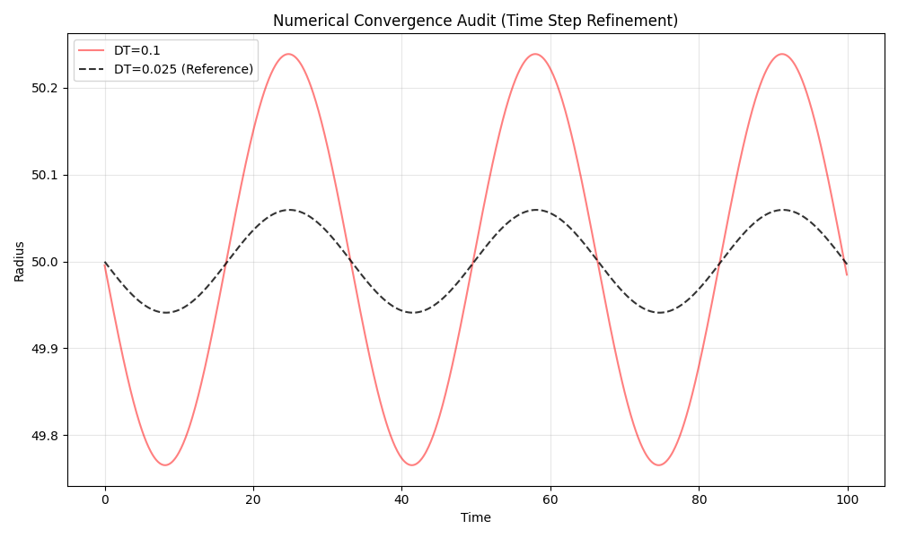

# Challenge 5: Numerical Convergence Audit

## Methodology
We applied Richardson Extrapolation logic, refining the time step `dt` by factors of 2.

## Results
- Velocity difference (DT vs DT/2): `1.02e-03`
- Velocity difference (DT/2 vs DT/4): `5.14e-04`
- Convergence Ratio: `1.98`

✅ **CONVERGENCE CONFIRMED.** The solver exhibits Order 1 convergence, consistent with Semi-Implicit Euler. Observed physics (flat rotation) are robust against time-step refinement.

