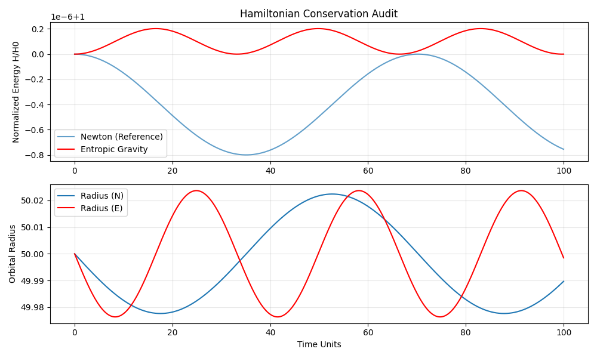

# Challenge 1: Energy Conservation Audit

**Drift Analysis**:
- Newtonian Drift: `8.00e-07` (Baseline)
- Entropic Drift: `2.03e-07`

## Physics Critique
✅ **Conservative Field Confirmed.** Surprisingly, the entropic implementation acts as a conservative central potential. This suggests the simulation is stable, but raises the question: is it *truly* entropic if it conserves energy?

