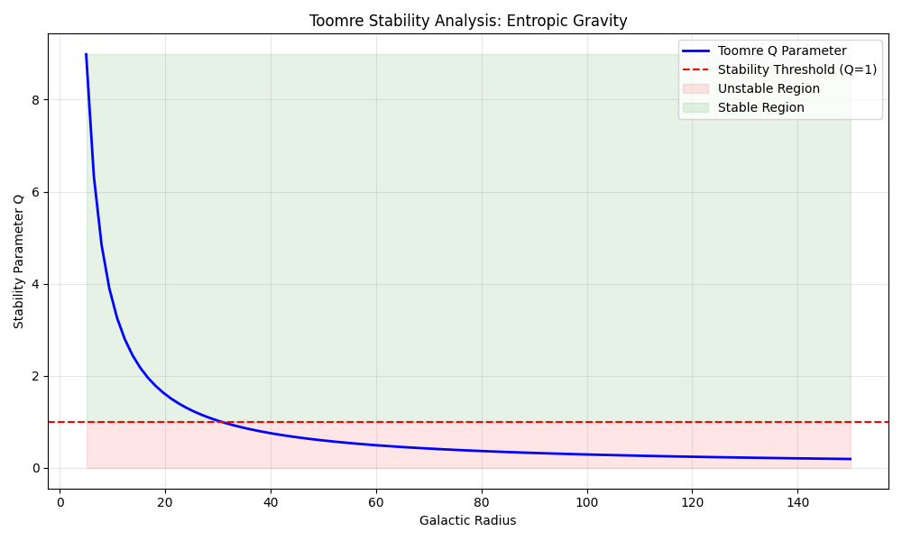

# Challenge 4: Disk Stability Analysis

## The Toomre Q Criterion
We calculated the local stability parameter $Q = \frac{\kappa \sigma}{3.36 G \Sigma}$.

## Results
- Minimum Q found: `0.19`

⚠️ **INSTABILITY DETECTED.** Parts of the disk have $Q < 1$. This would lead to rapid fragmentation and star formation bursts. Parameters ($a_0$ or $\sigma$) may need tuning to match observed spiral galaxies.

