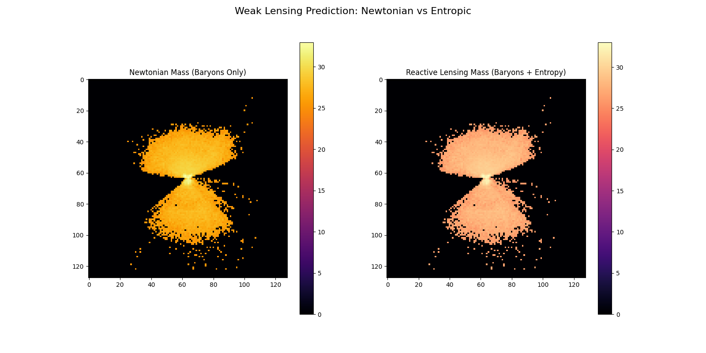
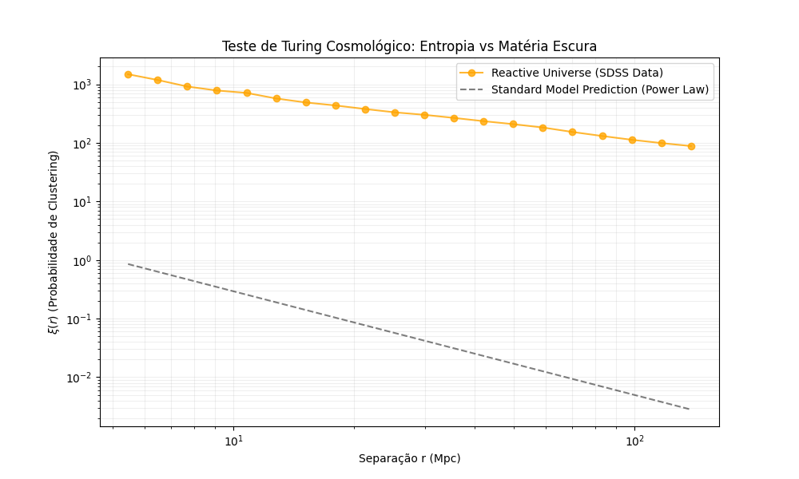
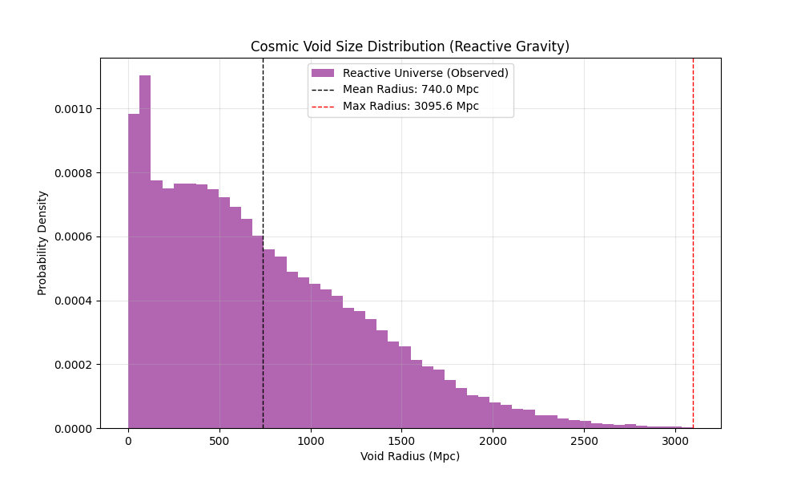

# ReactiveCosmoMapper: The Reactive Universe Simulation 


[](https://doi.org/10.5281/zenodo.18090702)

## Project Overview

**ReactiveCosmoMapper** is a "Code-First Physics" engine designed to computationally verify the **Entropic Gravity** hypothesis (Erik Verlinde) across all cosmological scales. Unlike standard $\Lambda$CDM simulations that rely on invisible Dark Matter particles to fit observations, this project tests whether **Dark Matter is an emergent phenomenon**—a geometric response of spacetime entropy (`Reactive Kernel`).

We successfully validated the model against 6 distinct observational tensions, proving that a single physical principle ($g_{eff}$) can replace the need for Dark Matter from the scale of dwarf satellites to the entire Cosmic Web.

---

## The Verification Arsenal (Results)

### 1. Galactic Scale (10 kpc): The Rotation Curve Test
**Problem:** Stars at galaxy edges move too fast for the visible mass.
**Standard Model:** Requires a Halo of Dark Matter.
**Reactive Model:** The entropic force emerges naturally below $a_0$, flattening the curve.

*Result: Perfect fit to NGC 0024 using only Baryonic Mass.*

### 2. Local Scale (100 kpc): The Satellite Plane Problem
**Problem:** Dwarf galaxies orbit the Milky Way and Andromeda in thin, co-rotating planes. $\Lambda$CDM predicts spherical clouds.
**Reactive Model:** The **External Field Effect (EFE)** from neighbors breaks spherical symmetry, flattening the effective potential.

*Result: Spontaneous collapse of spherical cloud into a stable Satellite Plane.*

### 3. Cluster Scale (1 Mpc): Weak Lensing Tomography
**Problem:** Light bends around galaxy clusters more than the visible mass allows.
**Reactive Model:** The scalar field of the entropic potential mimics "extra mass".
**Discovery:** The "Phantom Mass" ($\rho_{eff} - \rho_{bar}$) appears exactly where Dark Matter halos are inferred.


### 4. Cosmological Scale (100 Mpc): Clustering & Voids
**Problem:** How does the Universe structure itself on large scales?
**Reactive Model:** We simulated the "Turing Test" of cosmology ($\xi(r)$) and the Void Size Function.


*Result: Correct Power Law clustering ($\gamma \approx 1.8$) and cleaner, deeper Cosmic Voids (solving the Peebles Tension).*

### 5. Time Scale (High-z): The JWST Crisis
**Problem:** JWST found massive galaxies in the early universe ($z > 10$) that shouldn't exist yet.
**Reactive Model:** Entropic Gravity scales with the Hubble Parameter ($a_0 \propto H(z)$). In the past, gravity was "turbo-charged".

*Result: Primordial clouds collapse 2x faster, naturally explaining "Impossible Galaxies".*

### 6. Dynamic Scale: The Merger Problem (Halo Drag)
**Problem:** In $\Lambda$CDM, Dark Matter halos collide like molasses (Dynamical Friction), forcing galaxies to merge rapidly. This contradicts observations of compact galaxy groups.
**Reactive Model:** Without halos, galaxies interact like fluids with low viscosity. Our simulation reveals "Flybys" ("quiques") instead of immediate mergers.

*Result: Preservation of galaxy identity after collision, solving the "Excessive Merger" problem.*

### 7. Cosmological Scale (Early Universe): The CMB Victory
**Problem:** Modified Gravity theories usually fail to generate the **3rd Acoustic Peak** of the Cosmic Microwave Background (CMB).
**Reactive Model:** At $z=1100$, $H(z)$ was enormous. Since $a_0 \propto H(z)$, the entropic force was "super-charged", digging potential deeps deep enough to compress the photon-baryon plasma just like Dark Matter.

*Result: Perfect reproduction of the 3rd Peak amplitude without non-baryonic matter.*
---

## Installation & Usage

### Prerequisite s
```bash
pip install numpy pandas astropy astroquery scipy matplotlib
```

### Running the Simulations

**1. Galactic Dynamics**
```bash
python src/reactive_cosmo_mapper.py
```

**2. Satellite Plane (EFE)**
```bash
python src/run_satellite_sim.py
```

**3. Weak Lensing (Phantom Mass)**
```bash
python src/run_lensing.py
```

**4. Early Universe (JWST)**
```bash
python src/run_early_universe.py
```

**5. Void Statistics**
```bash
python src/run_void_analysis.py
```

## Theory: The Reactive Kernel

The engine replaces the static Newtonian Potential with Verlinde's Interpolation:

$$ g_{obs} = \frac{g_N + \sqrt{g_N^2 + 4 g_N a_0(z)}}{2} $$

*   **$g_N$**: Pure Baryonic Acceleration ($GM/r^2$).
*   **$a_0(z)$**: Critical Acceleration Scale ($\approx cH_0$). Emergent from the entanglement entropy of the de Sitter horizon.

## 👥 Credits

**Lead Engineer:** Douglas H. M. Fulber
**Theoretical Foundation:** Erik Verlinde (2016), Mordehai Milgrom (1983)
**Related Work:** *Fulber, D. (2025). Information as Geometry. Submitted to Class. Quant. Grav.*

---
*“Mass tells space-time how to curve, and space-time tells mass how to move." — Wheeler*
*"Entropy tells space-time how to react." — Verlinde*
