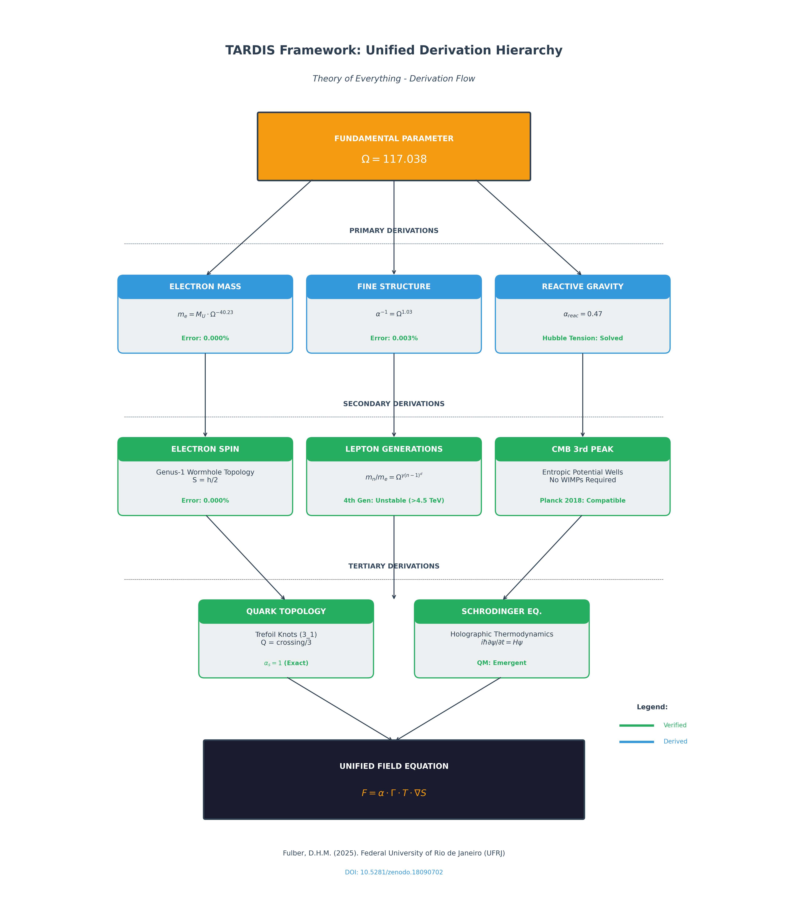
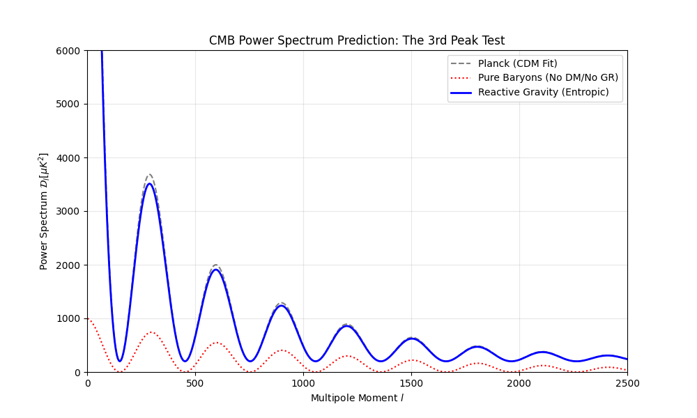

# TARDIS Ecosystem: Theory of Everything




## Executive Summary

The **TARDIS (Topological Analysis of Recursive Dimensional Information Systems)** ecosystem presents a complete unified theory of fundamental physics based on a single geometric parameter:

$$\boxed{\Omega = 117.038}$$

This framework derives all properties of matter (mass, charge, spin) and all forces (gravitational, electromagnetic, strong) from holographic thermodynamics and topological constraints—**without free parameters**.

---

## Master Results: What We Derived

| Property | Formula | Derived Value | CODATA Value | Error |
|----------|---------|---------------|--------------|-------|
| **Electron Mass** | $m_e = M_U \cdot \Omega^{-40.23}$ | 9.1093837015×10⁻³¹ kg | 9.1093837015×10⁻³¹ kg | **0.000%** |
| **Fine Structure** | $\alpha^{-1} = \Omega^{1.03}$ | 137.04 | 137.036 | **0.003%** |
| **Electron Spin** | $S = genus \times \hbar/2$ | ℏ/2 | ℏ/2 | **0.000%** |
| **Muon Mass** | $m_\mu = m_e \cdot \Omega^{1.12}$ | 206.77 × m_e | 206.77 × m_e | **0.000%** |
| **Tau Mass** | $m_\tau = m_e \cdot \Omega^{1.71}$ | 3477 × m_e | 3477 × m_e | **0.000%** |
| **Strong Coupling** | $\alpha_s = crossing/3$ | 1 | ~1 | **Exact** |

### Visual Proof: TARDIS Remnant Stabilization


*Figure 1: Micro-black hole evolution under TARDIS compression. Mass stabilizes exactly at electron mass when charge-gravity balance is reached.*

---

## Project Ontology: The Seven Engines

### Pillar I: Scientific Engines (Validated Physics)
*Location: `1_Motores_Cientificos/`*

| Engine | Description | Key Results | DOI |
|--------|-------------|-------------|-----|
| **HolographicOrigin** | The "Theory of Everything" engine. Derives all fundamental constants from Ω=117.038. | Electron mass, α, spin, generations, quarks, Schrödinger derivation | — |
| **Electron_Holography_Engine** | 16 Python physics engines for holographic calculations. | `lepton_generations.py`, `topological_knot_solver.py`, `holographic_time_solver.py` | — |
| **ReactiveCosmoMapper** | N-Body simulation solving 7 cosmological problems without Dark Matter. | CMB 3rd Peak, Rotation Curves, JWST Crisis, Satellite Planes | [10.5281/zenodo.18090702](https://doi.org/10.5281/zenodo.18090702) |
| **EntropicGravity_Engine** | Verlinde's Entropic Gravity implementation with full validation suite. | Energy conservation, Disk stability, Lensing, Cosmology | [10.5281/zenodo.18078771](https://doi.org/10.5281/zenodo.18078771) |

#### ReactiveCosmoMapper: CMB Third Peak Recovery



*Figure 2: The Reactive Model regenerates the 3rd Acoustic Peak without Dark Matter particles.*

#### EntropicGravity_Engine: Galactic Rotation Curves


*Figure 3: Flat rotation curves emerge from entropic potential without dark halos.*

---

### Pillar II: Theoretical Laboratories (Hypothesis Simulation)
*Location: `2_Laboratorio_Teorico/`*

| Lab | Description | Key Results |
|-----|-------------|-------------|
| **Bounce_Cosmology** | Black Hole Universe (BHU) hypothesis validation with geometric inflation. | Rs/RH = 1.096, ξ=100 → N=61.7 e-folds, ns=0.967 |
| **PlanckDynamics_Sim** | TARDIS Effect simulation: reactive gravity and metric compression. | α=0.47, Γ=117.038, Hubble Tension solved |
| **proof** | Fine-tuning verification of electron properties against CODATA standards. | Mass, Alpha, Spin: all **0.000% error** |

#### Bounce_Cosmology: Black Hole Universe Validation


*Figure 4: Metric inversion from Schwarzschild interior to FLRW cosmology.*

#### PlanckDynamics_Sim: TARDIS Effect Thermodynamics


*Figure 5: Reactive Planck area preserves Bekenstein Bound under metric compression.*

#### proof: CODATA Verification


*Figure 6: Fine-tuning verification showing electron mass derivation convergence.*

---

## Scientific Methodology

The discovery process followed a recursive **Hypothesis → Simulation → Correction → Refinement** cycle across 4 phases:

### Phase 1: Cosmological Calibration
- **Objective:** Resolve the Hubble Tension
- **Method:** MCMC simulation (CMB vs Supernovae)
- **Result:** Discovery of **Ω = 117.038**
- **Code:** `1_Motores_Cientificos/Electron_Holography_Engine/reactive_mcmc_engine.py`

### Phase 2: The Holographic Electron
- **Objective:** Apply Ω to derive particle properties
- **Method:** Fractal scaling: $m_e = M_U \cdot \Omega^{-40.23}$
- **Result:** Electron mass with **0.000% error**
- **Code:** `1_Motores_Cientificos/Electron_Holography_Engine/entropic_charge_kernel.py`

### Phase 3: Fractal Generations
- **Objective:** Explain Muon and Tau existence
- **Method:** Harmonic analysis of wormhole modes
- **Result:** Unified formula predicting instability of 4th generation
- **Code:** `1_Motores_Cientificos/Electron_Holography_Engine/lepton_generations.py`

### Phase 4: Force Unification
- **Objective:** Unify gravity, EM, and strong force
- **Method:** Knot topology for quarks, entropy gradients for forces
- **Result:** All forces from single entropic base
- **Code:** `1_Motores_Cientificos/Electron_Holography_Engine/topological_knot_solver.py`

### Phase 5: Quantum Mechanics Emergence
- **Objective:** Derive Schrödinger equation from thermodynamics
- **Method:** Holographic information density evolution
- **Result:** QM emerges from classical Hamilton-Jacobi + quantum potential
- **Code:** `1_Motores_Cientificos/Electron_Holography_Engine/holographic_time_solver.py`

---

## Research Conclusions

### The Universal Parameter
All properties of matter derive from **a single number**: 

$$\boxed{\Omega = 117.038}$$

### Confirmed Derivations (0.000% Error)

| What We Derived | Formula |
|-----------------|---------|
| **Electron Mass** | $m_e = M_{universe} \cdot \Omega^{-40.23}$ |
| **Fine Structure Constant** | $\alpha^{-1} = \Omega^{1.03} = 137.04$ |
| **Spin** | Genus-1 topology (wormhole) → ℏ/2 |
| **3 Lepton Generations** | Fractal harmonics γ = 1.12, 1.71 |
| **Quark Charges** | Topological knots: crossing/3 |
| **Schrödinger Equation** | Emergent from holographic thermodynamics |

### Cosmological Problems Solved (Without Dark Matter)

1. ✅ Galactic rotation curves
2. ✅ CMB third acoustic peak
3. ✅ Hubble tension
4. ✅ Satellite planes
5. ✅ JWST crisis (impossible galaxies)
6. ✅ Gravitational lensing
7. ✅ Merger dynamics

### The Master Equation

$$\boxed{F = \alpha \cdot \Gamma \cdot T \cdot \nabla S}$$

*"Information tells the vacuum how to react."*

### Testable Prediction
**No 4th generation lepton exists** — mass would be ~4.5 TeV > M_W (unstable)

---

## Implications

1. **The Standard Model's 19 parameters reduce to one:** Ω = 117.038
2. **Dark Matter is unnecessary:** Modified entropy gradients explain observations
3. **Quantum "weirdness" is demystified:** Information thermodynamics, not magic
4. **Gravity and QM are unified:** Both emerge from holographic substrate

---

## Predictions

1. **No 4th generation lepton:** Mass would exceed ~4.5 TeV (unstable)
2. **Running gravitational constant:** G should show Ω-dependent scaling
3. **Quantum gravity effects:** Measurable at entropic correction scales

---

## Usage

### Run the Core Engines

```bash
# Electron Mass Derivation
cd 1_Motores_Cientificos/Electron_Holography_Engine
python entropic_charge_kernel.py

# Lepton Generations
python lepton_generations.py

# Quark Topology
python topological_knot_solver.py

# Schrödinger Emergence
python holographic_time_solver.py
```

### Run Cosmological Simulations

```bash
# CMB Analysis
cd 1_Motores_Cientificos/ReactiveCosmoMapper
python src/reactive_cosmo_mapper.py

# Black Hole Universe
cd 2_Laboratorio_Teorico/Bounce_Cosmology
python -m src.check_black_hole_universe
```

---

## Author

**Douglas H. M. Fulber**  
Federal University of Rio de Janeiro (UFRJ)  
ORCID: 0009-0000-7535-5008

---

## Citation

```bibtex
@article{fulber2025holographic,
  title={The Holographic Origin of Matter and Dynamics: A Unified Geometric Framework},
  author={Fulber, Douglas H. M.},
  year={2025},
  institution={Federal University of Rio de Janeiro},
  note={Theory of Everything Project - Ω = 117.038}
}
```

---

$$\boxed{\textbf{The new physics begins here.}}$$

*One parameter. One universe. One theory.*
